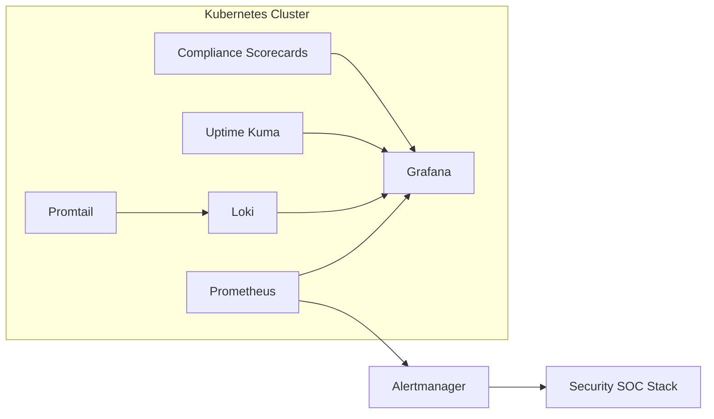

# Homelab Observability & Compliance Stack — Metrics, Logs & Security Scorecards

> Prometheus • Grafana • Loki/Promtail • Uptime Kuma • Compliance Scorecards (CIS, NIST) • Alerts → SOC

[](#license)


This repo contains the **observability and compliance layer** of the homelab. It provides metrics, logs, uptime checks, and compliance reporting tied back to SOC/security stacks.

---

## ✨ Highlights
- **Prometheus + Grafana** for metrics/dashboards
- **Loki + Promtail** for centralized logs
- **Uptime Kuma** for synthetic checks & service availability
- **Compliance Scorecards** (CIS, NIST, backups, vuln mgmt)
- **Alerting**: Prometheus Alertmanager + webhook → SOC (Wazuh/Security Onion)

---

## 🧭 High-Level Architecture



---

## 📁 Repo Layout

```
observability-compliance-stack/
├─ README.md
├─ .env.example
├─ kubernetes/
│  ├─ prometheus-grafana/
│  ├─ loki-promtail/
│  ├─ uptime-kuma/
│  └─ compliance-scorecards/
├─ docs/
│  ├─ METRICS.md
│  ├─ LOGGING.md
│  ├─ UPTIME.md
│  ├─ COMPLIANCE.md
│  └─ ALERTING.md
└─ .gitignore
```

---

## 🚀 Quick Start

### Deploy core monitoring
```bash
helm upgrade --install prometheus prometheus-community/kube-prometheus-stack -f kubernetes/prometheus-grafana/values.yaml
helm upgrade --install loki grafana/loki-stack -f kubernetes/loki-promtail/values.yaml
helm upgrade --install uptime-kuma uptime-kuma/uptime-kuma -f kubernetes/uptime-kuma/values.yaml
```

### Compliance Scorecards
- Custom JSON/YAML templates stored in `kubernetes/compliance-scorecards/`.
- Grafana dashboards visualize CIS/NIST/compliance gaps.

---

## 🔐 Security & Compliance Hooks
- Prometheus metrics scraped from Falco, Kyverno, Trivy (security posture).
- Loki centralizes Falco & Wazuh logs for long-term search.
- Uptime Kuma monitors external/public endpoints with alerts.
- Compliance scorecards map data to frameworks (CIS, NIST, backups).

---

## 📊 Dashboards
- **Grafana**: infra metrics, Kubernetes health, SOC security posture.
- **Compliance**: CIS % adherence, vuln trends, backup frequency, ingress security.
- **Uptime Kuma**: external ping/DNS/HTTP checks.

---

## 📌 Roadmap
- Add **OpenTelemetry Collector** for traces.
- Expand compliance scorecards to PCI-DSS and ISO27001 mappings.
- Automate report export to PDF/Markdown for audits.

---

## 🔗 Related Stacks
- [Platform Stack](../homelab-platform-stack)
- [Security SOC Stack](../homelab-security-soc-stack)
- [Infrastructure Stack](../homelab-infrastructure-stack)

---

## 📝 License
MIT — see `LICENSE`
